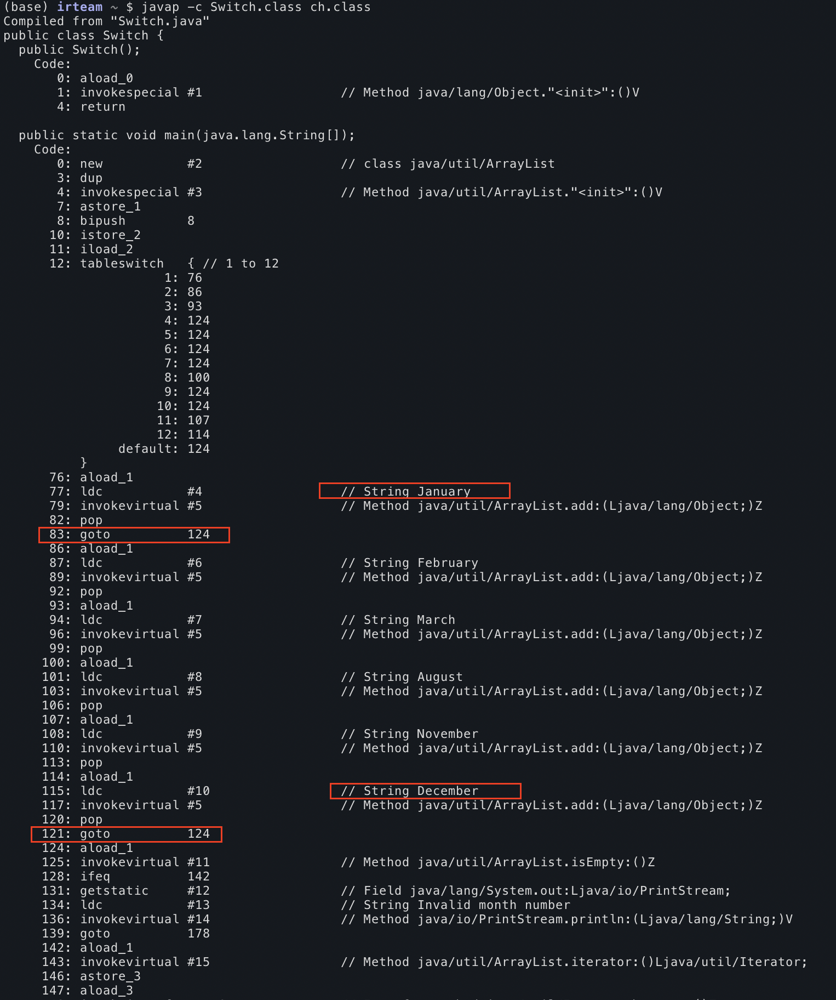

*이 글은 '백기선' 개발자님과 함께하는 온라인 자바 스터디에 참여하여 준비/학습한 내용을 정리하는 글입니다.📚*
- 4주차 : https://github.com/whiteship/live-study/issues/4
- 목표 : 자바가 제공하는 제어문을 학습.

정리는 [Java Tutorials - Control Flow Statements](https://docs.oracle.com/javase/tutorial/java/nutsandbolts/flow.html)를 기반으로 하였습니다. 

## Switch Statement
- switch 문은 primitive 타입인 `byte, short, char, int`와 `Enum` Type, `String`, 그리고 primitive type의 wrapper 객체 클래스인 `Character, Byte, Short, Integer`에 한해서 사용할 수 있다. 
- `switch` 문으로 짜는 코드는 사실 `if`문으로도 짤 수 있다. 하지만 if문 대신 switch문을 사용하면 가독성을 높일 수 있다. 

### break 문 
- switch문의 또 다른 유의점은 `break`문이다. switch문을 사용하면 각 case에 break문을 넣어주어야한다. 이게 처음에는 그러려니 했는데, 다시 생각해보니 이상했다. `break`문도 일종의 중복코드이다. 중복은 해악이라며 .. 왜 매 case문마다 break문을 작성해주어야 할까?
- 해답은 컴퓨터 프로그래밍 언어의 역사와 관련이 있었다. 오래전 C언어에서 switch문은, 분기를 처리해서 프로그램을 '특정 포인트' 로 이동시키는 `goto`문의 역할을 수행했다. 즉, `goto`로 특정 포인트로 이동하여 그 아래의 코드를 수행시키는 것이다. (참고 링크 : https://stackoverflow.com/a/2710359/9531818)
- 실제로 아래 코드를 실행해보면 8월에 해당하는 'August'만 출력되는 것이 아니라, August, September ... December 까지 출력이 된다.
```java
public class Switch {

    public static void main(String[] args) {
        java.util.ArrayList<String> futureMonths =
            new java.util.ArrayList<String>();

        int month = 8;

        switch (month) {
            case 1:  futureMonths.add("January");
            	break;
            case 2:  futureMonths.add("February");
            case 3:  futureMonths.add("March");
            case 4:  futureMonths.add("April");
            case 5:  futureMonths.add("May");
            case 6:  futureMonths.add("June");
            case 7:  futureMonths.add("July");
            case 8:  futureMonths.add("August");
            case 9:  futureMonths.add("September");
            case 10: futureMonths.add("October");
            case 11: futureMonths.add("November");
            case 12: futureMonths.add("December");
                break;
            default:
            	break;
        }

        if (futureMonths.isEmpty()) {
            System.out.println("Invalid month number");
        } else {
            for (String monthName : futureMonths) {
               System.out.println(monthName);
            }
        }
    }
}
```
- case문에 해당되면 코드를 실행한 뒤 switch문을 빠져나가는 것이 아니라, 그 아래의 로직들이 다 실행되는 것이다.(이를 **fall through 라고 표현한다) 이는 컴파일된 자바 바이트 코드를 열어보면 더욱 쉽게 이해할 수 있다.
- `javap -c Switch.class`를 통해 바이트코드를 살펴보면(아래 이미지 참고), 실제로 `break`문을 선언한 January, December 부분에는 `goto 124` 로 124번째 라인으로 이동하도록 기술되어 있다. 하지만 나머지는 `break`문을 선언하지 않았기 대문에 goto문이 없다. goto문이 없으니까 해당 라인 이후의 코드를 전부 실행하게 된다. 


### Java 13 에서 switch 문
- Java 13에서는 [JEP 354](https://openjdk.java.net/jeps/354)에서 `switch` 표현식이 개선되었다. 뭔가 2% 아쉬웠던 고전 프로그래밍 스타일의 switch문에서 조금 더 간결한 표현식을 사용할 수 있게 변경된 것 같다. 

#### AS-IS
- 이전의 java 에서 `switch`문은 C/C++ 문법을 그대로 가져온 형식이었다.
```java
switch (day) {
    case MONDAY:
    case TUESDAY:
        int temp = ...     // 'temp' 변수는 switch문의 종료(}) 이전까지 유효하기 때문에 다음 case 문에서 계속 사용할 수 없다.
        break;			   // 각 case를 종료할 때 break문을 반복해야 한다.
    case WEDNESDAY:
    case THURSDAY:
        int temp2 = ...    // Can't call this variable 'temp'
        break;
    default:
        int temp3 = ...    // Can't call this variable 'temp'
}
```

#### TO-BE
- `AS-IS`의 코드는 Java 13에서 아래처럼 개선할 수 있다.
```java
int numLetters = switch (day) {				// switch 문의 결과를 변수에 바로 할당할 수 있다. 
    case MONDAY, FRIDAY, SUNDAY -> 6;		// arrow 연산자를 사용해서 break문 없이 코드블럭을 실행하고 종료한다.
    case TUESDAY                -> 7;	
    case THURSDAY, SATURDAY     -> 8;
    case WEDNESDAY              -> 9;
    default -> {							// {}과 yeild로 코드블럭을 실행하고 결과값을 반환할 수 있다.
        int k = day.toString().length();
        int result = f(k);
        yield result;
    }
};
```

## If Statement
- `true` 로 evaluate 되는 경우에만 구문을 실행할 수 있다.
- switch문이 단일 값으로만 비교문이 실행되는 반면, if문은 범위나 다양한 값으로 표현식을 구성하여 구문을 작성할 수 있다. 

```java
// if-then
if (expression) {
	
}

// if-then-else
if (expression) {

} else if {

}
```

## While, Do-While
- 표현식이 `true`인 경우에 무한히 구문을 반복한다. 
- `while(true)`와 같은 구문도 많이 사용되는데, 적절한 경우/위치에 `break`문을 선언하여 무한루프에 빠지지 않도록 해야 한다. 특히나 `break`문에 걸리지 않는 한 무한히 실행되므로, 생각보다 많은 자원(CPU)을 점유한다.
- `while` 문보다는 사실 `for` 문이 더 일반적이기에 코드 이해도가 높다.(이 부분은 팀에서 코드리뷰에서도 이야기가 나왔었다.)

```java 
// while문
int count = 0;
while (count < 11) {
	System.out.print("Current count is " + count);
	count ++;
}

// for문
for (int i=0; i<11; i++) {
	System.out.print("Current count is " + count);
}
```

- do-while문은 일단 구문을 먼저 실행한 뒤 조건을 만족하면 계속 실행한다. while문과의 차이점은 비교문을 먼저 수행할지, 구문을 먼저 수행할지이다.
- 구문이 간단하면 괜찮은데, 몇십줄 이상 길어지는 경우에 do-while문은 후행되는 while문이 눈에 띄지 않는다. do-while문으로 작성할 수 있는 코드는 모두 while문으로도 작성할 수 있기 때문에 가독성을 위해서는 while문이 더 낫다.(고 한다.)

```java
do {
     statement(s)
     // statement가 길어진다고 상상해보자. while문이 뒤에 있어 눈에 띄지 않는다.
     // 코드를 읽다보면 while문을 만나야 한다는 사실을 까먹을 것이다.
} while (expression);
```

## For Loop
```java
for (initialization; termination; increment) {
    statement(s)
}
```
- initialization 표현식이 루프를 초기화한다. 딱 1번 실행되고, 루프의 시작점이다. 이 때 초기화한 변수는 루프 내에서(만) 쓰인다.
- termination 표현식이 `false`가 되면 루프는 종료된다. 
- increment(or decrement) 표현식은 매 루프가 돈 이후에 수행된다. 
- `Collections`나 `arrays` 를 iterate할 때는 아래와 같이 간결하게 사용할 수도 있다. forEach 라고도 하는데, 가능하면 이 표현식을 권장한다.
```java
for (type Object: IterableObject) {
	//
}
```

## Branching Statements
- 제어문에서는 `break`, `continue`와 `return`을 통해 구문을 끝내거나, 제어할 수 있다.
- 일반적으로 사용하는 `break, continue`는 **unlabeled** 로, 가장 가까이에 있는 루프를 빠져나간다. 
- 중첩 루프에서 원하는 특정 시점에 원하는 루프에서 빠져나갈 수 있도록 **labeled** break, continue도 제공한다.(사실 처음알았다.)
- 아래 예제 코드(source: https://docs.oracle.com/javase/tutorial/java/nutsandbolts/branch.html) 에서 특정 for문 위에 search라는 label을 지정하고, `break search`로 search 라벨에 해당하는 루프를 빠져나갈 수 있다. 
```java
class BreakWithLabelDemo {
    public static void main(String[] args) {

        int[][] arrayOfInts = { 
            { 32, 87, 3, 589 },
            { 12, 1076, 2000, 8 },
            { 622, 127, 77, 955 }
        };
        int searchfor = 12;

        int i;
        int j = 0;
        boolean foundIt = false;

	// Label
    search:
        for (i = 0; i < arrayOfInts.length; i++) {
            for (j = 0; j < arrayOfInts[i].length;
                 j++) {
                if (arrayOfInts[i][j] == searchfor) {
                    foundIt = true;
                    break search;
                }
            }
        }

        if (foundIt) {
            System.out.println("Found " + searchfor + " at " + i + ", " + j);
        } else {
            System.out.println(searchfor + " not in the array");
        }
    }
}
```


